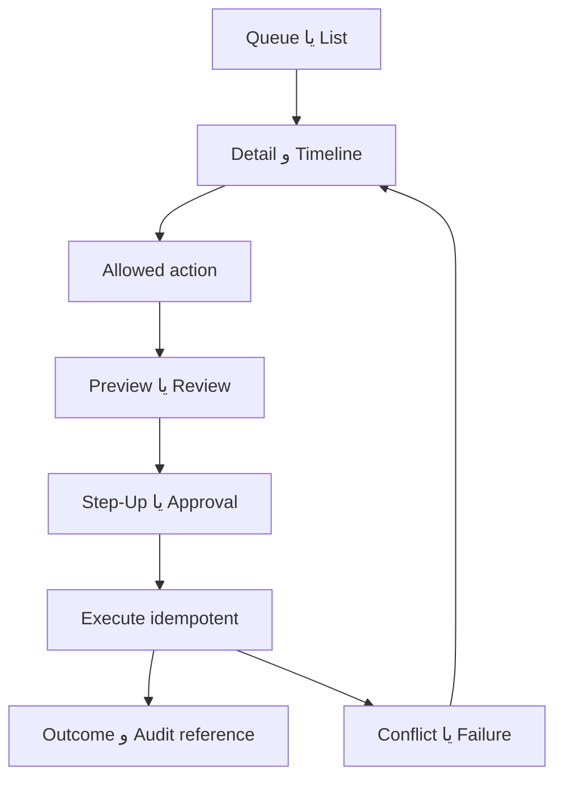

# Step 53 — Admin Experience Architecture

**Status:** COMPLETE / ADMIN JOURNEY GATE PASS

Admin EQCOFE یک «لیست endpoint» نیست؛ محیط کار Permission-aware برای تصمیم‌های عملیاتی و مالی است. Shell باید Staff، Customer و Service actor را جدا نگه دارد و Navigation فقط گروه‌هایی را نشان دهد که Staff برای آن‌ها Permission/Scope دارد. Backend همچنان مرجع نهایی Authorization است.

## Stable admin journeys

| ID | کار عملیاتی | خروجی معتبر | کنترل اجباری |
|---|---|---|---|
| AJ-01 | Catalog/Variant/Media تا Publish | محصول قابل فروش یا وضعیت توقف/Archive | validation، review، audit |
| AJ-02 | Bulk/FX pricing | Apply روی Preview معتبر | preview، step-up/approval، idempotency |
| AJ-03 | Inventory/Procurement | دریافت یا انتقال با lineage | permission، concurrency، reversal visibility |
| AJ-04 | Order/Fulfillment/Shipment | اقدام مجاز و handover | allowed-actions، allocation state |
| AJ-05 | Payment/Refund | reconcile/refund terminal | step-up، idempotency، fail-closed |
| AJ-06 | Return/Warranty | resolution immutable | review، inspection/repair، audit |
| AJ-07 | Wholesale review | approve/reject terminal | scope، step-up، no self-promotion |
| AJ-08 | Content/Marketing | approved publish/schedule | preview، review، version/status |
| AJ-09 | Finance/Report/Export | posted/finalized/bounded output | approval، Toman، reversal/history |
| AJ-10 | Staff/RBAC/Approval | least-privilege assignment | scope، step-up، session effects |
| AJ-11 | Security/Operations/Recovery | investigated/recovered incident | fail-closed، preview، audit reference |
| AJ-12 | Provider/Config/Notification | controlled change/delivery action | health، approval، secret boundary |

## List-detail-action pattern

هر گروه Admin از یک الگوی مشترک مفهومی استفاده می‌کند:

1. Queue/List با Filter، Pagination، وضعیت و «نیازمند اقدام»؛ بدون Query نامحدود.
2. Detail با Summary، Timeline/History، actor/audit metadata امن و Related entities.
3. Allowed actions از Contract/State جاری؛ Action قدیمی پس از Refresh یا Conflict دوباره ارزیابی شود.
4. Preview/Review برای تغییرات مالی، قیمت، پیکربندی و Restore.
5. Step-Up/Approval برای عملیات حساس.
6. Outcome با Reference قابل پیگیری؛ موفقیت optimistic قبل از پاسخ authoritative ممنوع.

## Permission-aware navigation

- Navigation item فقط در صورت دسترسی مرتبط دیده می‌شود؛ Bookmark مستقیم همچنان باید 401/403/404 مناسب بگیرد.
- Scope فهرست و Detail را محدود می‌کند؛ وجود Permission عمومی به معنی دسترسی به همه Store/Warehouse/Customerها نیست.
- Action حساس ممکن است قابل مشاهده ولی قفل باشد تا نیاز Step-Up/Approval را توضیح دهد؛ اطلاعات Secret یا payload حساس نمایش داده نمی‌شود.
- تغییر Role/Scope، disable Staff، revoke Session و FIDO recovery باید اثر امنیتی و نیاز ورود مجدد را واضح کند.
- Approval queue باید درخواست، درخواست‌کننده، دامنه اثر، Preview، expiry و تصمیم terminal را نشان دهد.

## Domain handoffs

| از | به | Context لازم |
|---|---|---|
| Order | Payment/Refund | order/payment identity، attempts، authoritative status |
| Order | Fulfillment/Shipment | items، allocation، allowed actions، destination snapshot |
| Customer | Return/Warranty | owned order/item، eligibility، immutable timeline |
| Wholesale | Customer/Pricing | application decision، authoritative customer type |
| Pricing/FX | Approval/Audit | preview hash، affected scope، requested change |
| Inventory/Procurement | Finance | receipt/cost/FIFO lineage؛ بدون ویرایش مستقیم مالی |
| Operations | Queue/Outbox/Recovery | backlog، attempt، failure summary، bounded safe action |

## Dangerous-action language

نام Action باید نتیجه واقعی را بیان کند: «توقف فروش»، «لغو سفارش»، «برگشت سند»، «ابطال Session»، «پیش‌نمایش بازیابی» و «اجرای بازیابی». Action destructive یا irreversible به confirmation با دامنه اثر نیاز دارد؛ Confirmation عمومی مانند «مطمئنید؟» کافی نیست. Step 54 شکل Component را تعیین می‌کند، اما اطلاعات لازم از همین Step ثابت است.

## Scope handoff

Step 56 این معماری را به Admin wireframe تبدیل می‌کند. هیچ Layout، table density، typography، icon یا visual hierarchy در Step 53 Freeze نشده است. Step 67–78 باید Navigation/Actionها را از Permission/Scope و Contractهای authoritative پیاده کنند؛ سند حاضر مجوز دورزدن RBAC یا ساخت endpoint تازه نیست.

