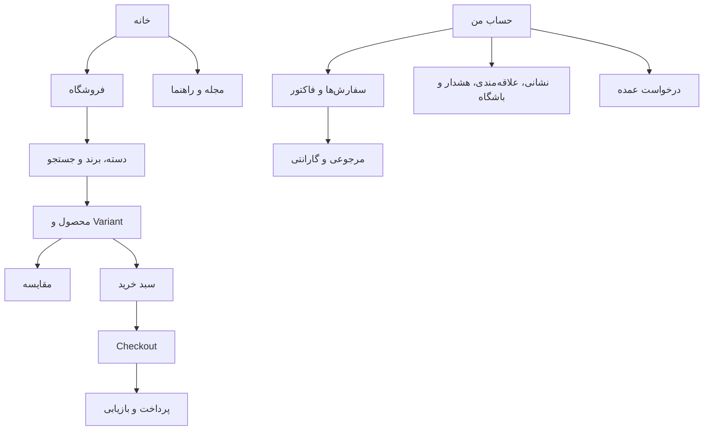
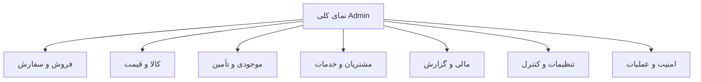

# Step 53 — Information Architecture

**Status:** COMPLETE / IA CONTRACT GATE PASS

**Editable overview:** [EQCOFE Step 53 — Information Architecture](https://www.figma.com/board/3UPcK6wqP7k85YKw4xpYHi)

## هدف و مرز

این سند معماری اطلاعات Persian-first/RTL را پیش از طراحی بصری و پیاده‌سازی Frontend تثبیت می‌کند. ساختار بر اساس سه خانواده کاربر—مهمان، مشتری و Staff—تنظیم شده است. اصطلاحات فنی Backend نباید مستقیماً به برچسب ناوبری مشتری تبدیل شوند و Admin نیز باید بر اساس کار عملیاتی گروه‌بندی شود، نه صرفاً نام Moduleها.

## اصول

1. مسیر اصلی خرید در هر عرض صفحه قابل یافتن می‌ماند: کشف ← ارزیابی ← سبد ← Checkout ← پرداخت ← پیگیری.
2. «حساب من» فقط منابع متعلق به Customer را نمایش می‌دهد؛ Staff و Customer shell هرگز مشترک نیستند.
3. قیمت عمده یک مقصد ناوبری مستقل برای همه نیست؛ فقط پس از Approval authoritative در Context خرید ظاهر می‌شود.
4. وضعیت سفارش، پرداخت و خدمات پس از فروش از Timelineهای authoritative خوانده می‌شود و با متن محلی حدس زده نمی‌شود.
5. Admin navigation بر اساس Permission و Scope فیلتر می‌شود؛ کنترل مخفی‌شده جایگزین پاسخ 403 یا بررسی Server-side نیست.
6. عملیات حساس از View/Review جدا و با Preview، Step-Up، Approval و Audit reference نمایش داده می‌شوند.

## Storefront sitemap

### ناوبری عمومی

| گروه | مقصدها | Actor | قاعده |
|---|---|---|---|
| خانه | ورودی کشف، کمپین معتبر، دسته‌های اصلی | همه | هیچ موفقیت Provider یا تخفیف ساختگی نمایش داده نشود |
| فروشگاه | دسته، برند، جستجو، محصول | همه | قیمت/موجودی از پاسخ جاری؛ Product خارج از موجودی حذف کور نشود |
| مقایسه | انتخاب و جدول مقایسه | همه | حداکثر چهار محصول و سازگاری دسته |
| مجله و راهنما | Article، محتوای مرتبط، Policy | همه | محتوا از وضعیت Published/Canonical مصرف شود |
| سبد | اقلام، مقدار، Quote | همه | تغییر قیمت/موجودی پیش از Checkout آشکار شود |
| حساب من | منابع Customer-owned | احراز‌شده | Ownership در Server enforce می‌شود |

### Account sitemap

- نمای کلی: سفارش اخیر، وضعیت اقدام لازم، Notificationهای مهم.
- پروفایل و امنیت: اطلاعات هویتی، Session و خروج از دستگاه‌ها.
- نشانی‌ها: فهرست، ایجاد/ویرایش/حذف و یک نشانی پیش‌فرض.
- سفارش‌ها: فهرست، Detail، Timeline، Invoice، لغو مجاز، پرداخت مجدد امن.
- علاقه‌مندی و هشدار: Reference به Product جاری، نه Snapshot قیمت/موجودی.
- باشگاه مشتریان: مانده غیرنقدی، History و Benefit؛ هیچ Wallet وجود ندارد.
- عمده‌فروشی: معرفی، درخواست، Status و Context خرید پس از Approval.
- خدمات پس از فروش: Return و Warranty با Detail و Timeline جدا.

## Admin sitemap

| گروه | زیرگروه‌های اصلی | الگوی اقدام |
|---|---|---|
| فروش و سفارش | Orders، Payments، Refunds، Fulfillment، Shipments، POS | Queue/List ← Detail/Timeline ← Allowed Action |
| کالا و قیمت | Catalog، Variant، Media، Pricing، FX، Excel، Marketing، Content، Reviews | Draft ← Validate/Preview ← Review/Apply/Publish |
| موجودی و تأمین | Inventory، Warehouse، Reservation، Transfer، Procurement، Supplier | Observe ← Request ← Approve ← Execute ← Reconcile |
| مشتریان و خدمات | Customer، Wholesale، Loyalty، Return، Warranty، Notification | Search ← Customer/Case timeline ← Scoped action |
| مالی و گزارش | Journals، Costs، Profit، Reports، Exports، Analytics | Read/Preview ← Approval ← Post/Finalize/Export |
| تنظیمات و کنترل | Configuration، Feature flags، Integrations، Staff، RBAC، Approvals | Read ← Change request/Preview ← Step-Up/Approve ← Apply |
| امنیت و عملیات | Security، Incidents، Alerts، Queues، Jobs، Backups، Data quality | Detect ← Acknowledge ← Investigate ← Recover ← Close |

## Routing and URL contract for later steps

Step 53 نام Route frontend یا فناوری Router را تعیین نمی‌کند. Stepهای 55–58 باید URLهای پایدار، قابل Bookmark و SEO-friendly را از این IA بسازند. Detailهای Customer باید با شناسه عمومی امن مانند `order_number`/`return_number` کار کنند؛ Admin می‌تواند شناسه داخلی را مصرف کند اما همچنان Permission/Scope Server-side لازم است.

## Gate result

تمام مقصدهای الزامی Roadmap—Storefront، Retail، Wholesale، Checkout، Account، After-sales و Administration—دارای جای مشخص در IA هستند. هیچ Backend endpoint جدید، Business Rule جدید یا تصمیم بصری Step 54–57 وارد این سند نشده است.
