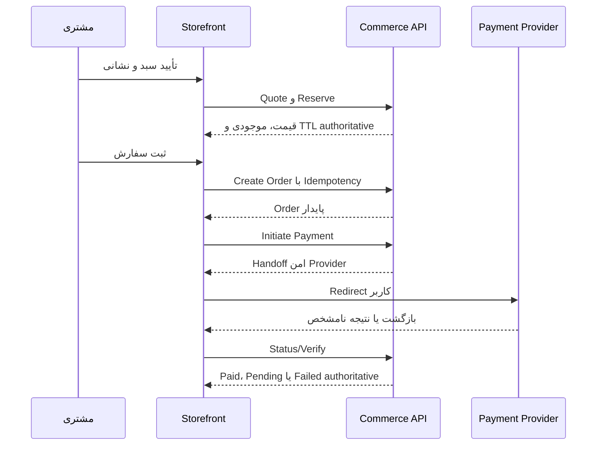

# Step 53 — Storefront & Customer User Journeys

**Status:** COMPLETE / JOURNEY COVERAGE GATE PASS

شناسه‌های `SJ-*` پایدارند و تعریف ماشین‌خوان آن‌ها در `step53-experience-contract.json` نگهداری می‌شود. هر Journey باید در Wireframe و Implementation بعدی موفقیت، Failure و Recovery را پوشش دهد؛ Happy path به‌تنهایی کافی نیست.

## Journey map

| ID | سفر | Actor | آغاز | پایان معتبر | ریسک اصلی |
|---|---|---|---|---|---|
| SJ-01 | کشف محصول | مهمان/مشتری | خانه، دسته، برند، جستجو | Product/Variant قابل ارزیابی | No-result، stock/media stale |
| SJ-02 | مقایسه | همه | Listing/PDP | حداکثر ۴ محصول هم‌دسته | انتخاب ناسازگار |
| SJ-03 | OTP و Merge سبد | مهمان | Login gate | Session + cart merge | OTP/merge conflict |
| SJ-04 | سبد تا Order | همه | Cart | Order پایدار | price/stock/TTL/idempotency |
| SJ-05 | پرداخت و Recovery | مشتری | unpaid Order | authoritative result | callback/unknown/late payment |
| SJ-06 | پروفایل و نشانی | مشتری | حساب من | داده customer-owned معتبر | ownership/default invariant |
| SJ-07 | سفارش و فاکتور | مشتری | سفارش‌های من | detail/timeline/action مجاز | cancel eligibility |
| SJ-08 | مرجوعی | مشتری | Order detail | Return timeline/resolution | eligibility/terminal state |
| SJ-09 | گارانتی | مشتری | Order detail/account | Claim timeline/resolution | eligibility/immutable history |
| SJ-10 | درخواست عمده | Retail | معرفی/حساب | authoritative application status | self-promotion ممنوع |
| SJ-11 | خرید عمده | Wholesale approved | Product/Cart | wholesale Order | min quantity/current type |
| SJ-12 | علاقه‌مندی/هشدار/باشگاه/نظر | مشتری | PDP/account | resource-owned state | stale copy/moderation |

## Critical commerce sequence

### قواعد SJ-04 و SJ-05

- Quote باید تغییر قیمت، تخفیف، مالیات، موجودی و حداقل مقدار را پیش از Submit آشکار کند.
- Reservation/Checkout TTL برابر Business Rule جاری است و UI باید زمان انقضا را به‌عنوان وضعیت Server-owned تلقی کند.
- دکمه Submit پس از ارسال قفل بصری می‌شود، ولی محافظ اصلی Idempotency در Backend باقی می‌ماند.
- بازگشت از Provider به معنی موفقیت نیست؛ UI فقط Status/Verify authoritative را نمایش می‌دهد.
- `unknown` یا timeout باید مسیر «بررسی مجدد نتیجه» بدهد، نه ساخت Payment جدید بدون کنترل.
- پرداخت دیرهنگام یا نتیجه متناقض به پیام صادقانه و مسیر پشتیبانی/بررسی نیاز دارد.

## Account and ownership rules

- Deep-link نامعتبر، resource متعلق به Customer دیگر و Session منقضی سه وضعیت متفاوت‌اند؛ همه به «یافت نشد» مبهم تبدیل نشوند.
- Snapshot سفارش/فاکتور مستقل از تغییر بعدی Catalog نمایش داده می‌شود.
- لغو فقط وقتی Action مجاز است دیده/فعال می‌شود و رد Backend باید بدون از دست دادن Context نمایش داده شود.
- Wishlist و Alert به Product جاری اشاره می‌کنند؛ قیمت یا موجودی کپی‌شده نباید حقیقت مستقل بسازد.
- Loyalty یک دفتر امتیاز غیرنقدی است و نباید با واژه یا الگوی Wallet نمایش داده شود.

## After-sales state journeys

Return و Warranty دو مسیر جدا با Eligibility، فرم درخواست، Review و Timeline مستقل‌اند. Customer باید بداند چه چیزی ثبت شده، چه مدرکی لازم است، پرونده اکنون دست چه مرحله‌ای است و آیا Action بعدی دارد. تصمیم رد/تأیید/Resolution نباید با Refresh یا عملیات بعدی بازنویسی بصری شود.

## Wholesale journey rules

مشتری Retail تا لحظه Approval authoritative، حتی پس از Submit، Retail باقی می‌ماند. یک Application فعال مجاز است. پس از Approval، قیمت عمده و حداقل مقدار در Context Product/Cart/Quote دیده می‌شود؛ نمایش badge محلی بدون تأیید Session/API ممنوع است. Rejected و Approved terminal هستند و UI نباید وعده ویرایش تصمیم بدهد.

## Later-step acceptance handoff

Step 55 باید برای SJ-01 تا SJ-12 Wireframe داشته باشد؛ Step 57 باید حداقل SJ-03، SJ-04، SJ-05، SJ-08، SJ-09 و SJ-10 را در Prototype قابل پیمایش نشان دهد. Stepهای 58–65 باید هر Journey را با تست State/Recovery و Actor isolation پیاده کنند.

